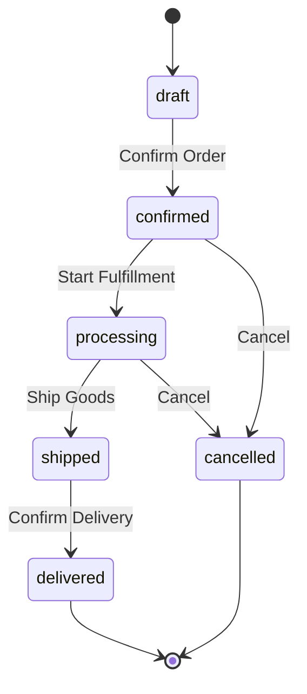
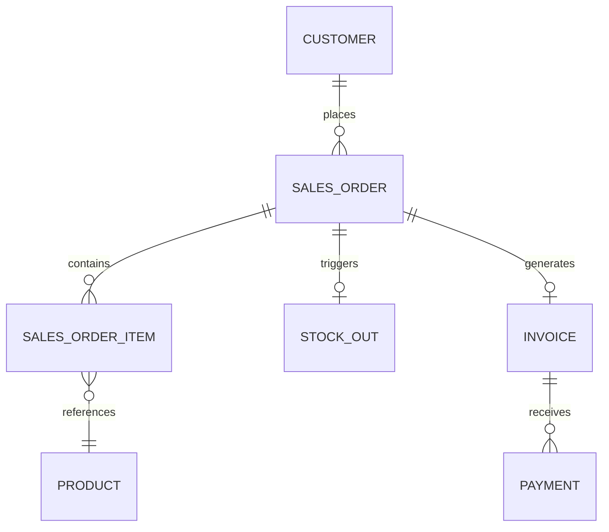
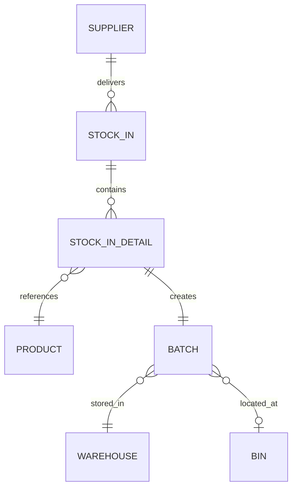
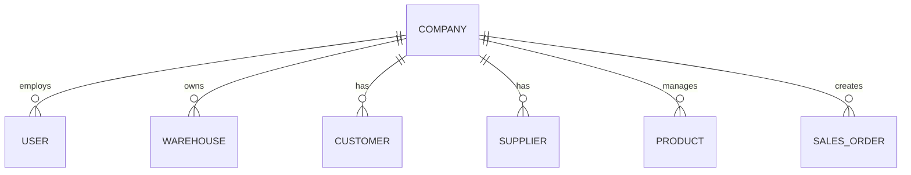

# AgroWMS Business Logic Documentation

> **Purpose**: This document explains the core business logic, workflows, and authorization rules for AgroWMS. It serves as a reference for developers and stakeholders.

---

## Table of Contents

1. [Multi-Tenancy & Data Isolation](#1-multi-tenancy--data-isolation)
2. [Authorization & Policies](#2-authorization--policies)
3. [Sales Order Workflow](#3-sales-order-workflow)
4. [Invoice Generation](#4-invoice-generation)
5. [Known Issues & Explanations](#5-known-issues--explanations)
6. [Entity Relationships](#6-entity-relationships)

---

## 1. Multi-Tenancy & Data Isolation

AgroWMS is a **multi-tenant SaaS application**. Each tenant (company) has completely isolated data.

### How It Works

```
User → company_id → TenantScope → Filtered Data
```

| Component | File | Purpose |
|-----------|------|---------|
| `TenantScope` | `app/Models/Scopes/TenantScope.php` | Global scope that auto-adds `WHERE company_id = ?` to all queries |
| `BelongsToTenant` | `app/Models/Traits/BelongsToTenant.php` | Trait that applies TenantScope and auto-sets `company_id` on creation |

### Key Rules

1. **Every tenant-scoped model** uses the `BelongsToTenant` trait
2. **Data is invisible** across tenants — User A cannot see User B's stock
3. **company_id is immutable** — Once set, it never changes
4. **Super-admins** can bypass scope via `app()->bind('disable_tenant_scope', fn() => true)`

### Models Using BelongsToTenant

- `SalesOrder`, `Customer`, `Supplier`, `Product`, `Category`
- `Warehouse`, `StockIn`, `StockOut`, `Batch`
- `Invoice`, `Payment`, `Expense`, `Document`

---

## 2. Authorization & Policies

AgroWMS uses Laravel's **Policy-based authorization** combined with **Spatie Permission** for role-based access control.

### Two-Layer Authorization

```
┌─────────────────────────────────────────────────────────┐
│  Layer 1: TenantScope (Data Filtering)                  │
│  → Automatically filters queries by company_id          │
│  → Prevents cross-tenant data leakage                   │
└─────────────────────────────────────────────────────────┘
                           ↓
┌─────────────────────────────────────────────────────────┐
│  Layer 2: Policies (Action Authorization)               │
│  → Determines if user can VIEW/CREATE/UPDATE/DELETE     │
│  → Defined in app/Policies/*                            │
└─────────────────────────────────────────────────────────┘
```

### Registered Policies

| Model | Policy | Location |
|-------|--------|----------|
| `Batch` | `BatchPolicy` | `app/Policies/BatchPolicy.php` |
| `Document` | `DocumentPolicy` | `app/Policies/DocumentPolicy.php` |

### Permission Gates

Defined in `AuthServiceProvider::definePermissionGates()`:

- `stock.in.create`, `stock.out.create`, `stock.adjustment`
- `transaction.approve`, `transaction.reject`
- `finance.view`, `currency.manage`
- `user.manage`, `role.manage`
- `report.view`, `report.export`

### How Authorization Works

```php
// In Controller
$this->authorize('view', $salesOrder);

// Laravel looks for:
// 1. SalesOrderPolicy::view() — if exists, use it
// 2. Gate::before() — checks hasPermissionTo()
// 3. If no policy or gate matches → DENIES (403)
```

> [!IMPORTANT]
> **If no Policy exists for a model, Laravel denies by default.**

---

## 3. Sales Order Workflow

### Lifecycle States



### Payment States

| Status | Description |
|--------|-------------|
| `unpaid` | No payment received |
| `partial` | Partial payment received |
| `paid` | Fully paid |
| `overdue` | Past due date, unpaid |

### Business Rules

1. **SO Number Generation**: `SO-{YYYYMMDD}-{SEQUENCE}`
2. **Currency Recording**: Exchange rate locked at transaction time
3. **Net Amount**: `total - transaction_fees`
4. **Stock Out Link**: SO can be linked to a `stock_out_id` for fulfillment

---

## 4. Invoice Generation

### Workflow

```
SalesOrder (status=confirmed+)
    ↓
PdfController::invoice($salesOrder)
    ↓
$this->authorize('view', $salesOrder)  ← AUTHORIZATION CHECK
    ↓
PdfService::generateInvoice()
    ↓
Download PDF
```

### Routes

| Route | Method | Action |
|-------|--------|--------|
| `/pdf/sales-orders/{id}/invoice` | GET | Download invoice PDF |
| `/pdf/sales-orders/{id}/packing-list` | GET | Download packing list |
| `/invoices/{id}/pdf` | GET | View invoice (via InvoiceController) |

### Authorization Requirement

The `PdfController` explicitly calls `$this->authorize('view', $salesOrder)`:

```php
public function invoice(SalesOrder $salesOrder)
{
    $this->authorize('view', $salesOrder); // ← This line
    $pdf = $this->pdfService->generateInvoice($salesOrder);
    return $pdf->download("invoice-{$salesOrder->so_number}.pdf");
}
```

> [!CAUTION]
> **Currently, no `SalesOrderPolicy` is defined.** This means authorization fails with 403.

---

## 5. Known Issues & Explanations

### Issue: 403 Forbidden on `/pdf/sales-orders/{id}/invoice` — **FIXED ✅**

**Root Cause (Historical):**

The 403 was caused by `$this->authorize('view', $salesOrder)` calling a non-existent `SalesOrderPolicy`.

**Resolution (Phase T: Authorization Hardening):**

1. Created `app/Policies/SalesOrderPolicy.php` with:
   - `company_id` double-check (defense-in-depth on top of TenantScope)
   - Spatie permission integration (`sales.view`, `invoice.view`)
   - Separate `viewInvoice()` method for financial segregation

2. Updated `PdfController::invoice()` to use `viewInvoice` policy method
3. Added new permissions to `PermissionSeeder`:
   - `sales.view` — Warehouse staff can view SO for packing
   - `invoice.view` — Finance only can view invoices with prices

**To Apply the Fix:**

Run the permission seeder to add new permissions:
```bash
php artisan db:seed --class=PermissionSeeder
```

**Permission Matrix:**

| Role | sales.view | invoice.view | Can Download Invoice? |
|------|------------|--------------|----------------------|
| Admin | ✅ | ✅ | ✅ Yes |
| Manager | ✅ | ✅ | ✅ Yes |
| Staff | ✅ | ❌ | ❌ No (403) |
| Viewer | ❌ | ❌ | ❌ No (403) |

### Solution Options

**Option A: Create SalesOrderPolicy (Recommended)**

```php
// app/Policies/SalesOrderPolicy.php
class SalesOrderPolicy
{
    public function view(User $user, SalesOrder $salesOrder): bool
    {
        // TenantScope already filtered, so if found, user can view
        return $user->company_id === $salesOrder->company_id;
    }
    
    public function create(User $user): bool
    {
        return true; // All authenticated users can create
    }
}
```

**Option B: Remove authorize() call**

Remove the `$this->authorize()` line from PdfController, relying solely on TenantScope for protection.

```php
public function invoice(SalesOrder $salesOrder)
{
    // TenantScope already prevents cross-tenant access via route model binding
    $pdf = $this->pdfService->generateInvoice($salesOrder);
    return $pdf->download("invoice-{$salesOrder->so_number}.pdf");
}
```

**Recommended: Option A** — Explicit policies are better for security auditing.

---

## 6. Entity Relationships

### Sales Flow



### Inventory Flow



### Company Context



---

## Quick Reference: Demo Credentials

Run `php artisan db:seed --class=DemoUserSeeder` to create these users:

| Role | Email | Password |
|------|-------|----------|
| Owner (Admin) | `owner@avandigital.id` | `demo1234` |
| Manager | `manager@avandigital.id` | `demo1234` |
| Staff | `staff@avandigital.id` | `demo1234` |

All users belong to **AVANDIGITAL** company (ID: 1).

---

## Appendix: File Reference

| Purpose | File |
|---------|------|
| Tenant Scope | `app/Models/Scopes/TenantScope.php` |
| Tenant Trait | `app/Models/Traits/BelongsToTenant.php` |
| PDF Controller | `app/Http/Controllers/PdfController.php` |
| PDF Service | `app/Services/PdfService.php` |
| Auth Provider | `app/Providers/AuthServiceProvider.php` |
| Web Routes | `routes/web.php` |

---

*Last Updated: 2026-01-27*
