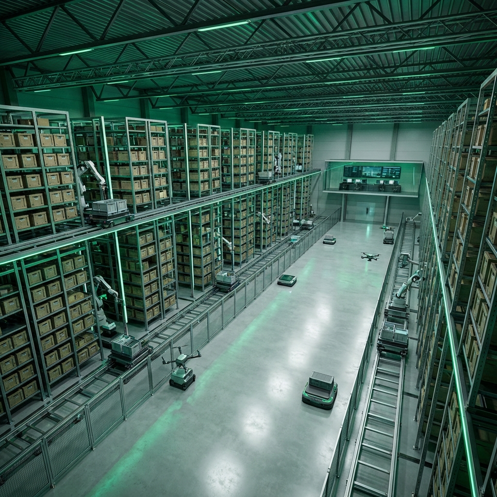

<div align="center">
  <a href="https://avandigital.id">
    
  </a>

  <h1 align="center" style="font-size: 3rem; margin-top: 1rem;">AgroWMS</h1>

  <p align="center" style="font-size: 1.2rem; color: #555;">
    <b>Manajemen Gudang Tanpa Pusing.</b>
    <br>
    The Enterprise-Grade Warehouse Management System for Modern Business.
  </p>

  <p align="center">
    <a href="#-features">Features</a> •
    <a href="#-tech-stack">Tech Stack</a> •
    <a href="#-getting-started">Getting Started</a> •
    <a href="#-architecture">Architecture</a> •
    <a href="#-contributing">Contributing</a>
  </p>

  <p align="center">
    
    
    
    
  </p>
</div>

---

## 🚀 Why AgroWMS?

Managing a warehouse shouldn't be a headache. **AgroWMS** ("Anti-Pusing") replaces chaotic Excel sheets and manual tracking with a streamlined, intelligent system desigend for precision and speed.

### 🌟 Unique Selling Propositions
*   **🎯 Precision Inventory**: Real-time tracking down to the **Bin Location** level. Never lose an item again.
*   **💰 True Profit Tracker**: Automated **FIFO/FEFO** costing ensures your financial reports reflect reality, not guesswork.
*   **🌍 Global Traceability**: Complete audit trail from **Supplier -> Warehouse -> Customer**. Handling batch expiry and lot tracking effortlessly.
*   **🔒 Enterprise Security**: Built with **Tenant Isolation** standards (UU PDP/GDPR ready) to keep your data sovereign and secure.

---

## ✨ Key Features

### 🏢 Multi-Tenant Architecture
*   **Data Isolation**: Strict row-level security using Global Scopes (`TenantScope`).
*   **Role-Based Access Control (RBAC)**: Granular permissions for Admin, Manager, and Staff.

### 📦 Smart Logistics
*   **Inbound**: Purchase Orders, Quality Check, and Put-away strategies.
*   **Outbound**: Sales Orders, Picking Lists (Wave/Batch), and Packing Slips.
*   **Internal**: Stock Transfers, Adjustments, and Stock Opname (Blind Counts).

### 📊 Intelligence
*   **Dashboard**: Real-time metrics on Stock Value, Turnover, and Low Stock Alerts.
*   **Reports**: Inventory Aging, Stock Movement Cards, and Profit Margins.
*   **Docs**: PDF Generation for Invoices, Delivery Orders, and Barcodes.

---

## 🛠 Tech Stack

**Backend**
*   **Framework**: Laravel 12 (PHP 8.2+)
*   **Database**: MySQL 8.0 / MariaDB 10.5
*   **Caching**: Redis
*   **Queue**: Database / Redis

**Frontend**
*   **Styling**: Tailwind CSS 3.0 (Emerald Theme)
*   **Interactivity**: Alpine.js
*   **Icons**: Heroicons

---

## 🚀 Getting Started

### Prerequisites
*   PHP >= 8.2
*   Composer
*   Node.js & NPM
*   MySQL

### Installation

1.  **Clone the Repo**
    ```bash
    git clone https://github.com/StartAgro/AgroWMS.git
    cd AgroWMS
    ```

2.  **Install Dependencies**
    ```bash
    composer install
    npm install
    ```

3.  **Environment Setup**
    ```bash
    cp .env.example .env
    php artisan key:generate
    ```
    *Edit `.env` with your database credentials.*

4.  **Database & Seeding**
    ```bash
    php artisan migrate --seed
    ```
    *Seeds default Super Admin and Demo Data.*

5.  **Run Application**
    ```bash
    npm run build
    php artisan serve
    ```
    Visit `http://localhost:8000`.

### Default Credentials
*   **Email**: `admin@agrowms.com`
*   **Password**: `password`

---

## 🏗 Architecture

We follow **Domain-Driven Design (DDD)** principles wrapped in a Service-Oriented structure.

*   **Controllers**: Thin HTTP layer, delegating logic to Services.
*   **Services**: Encapsulated business logic (e.g., `BatchService`, `StockMovementService`).
*   **Models**: Rich domain entities with `TenantScope` for security.

📖 **[Read the Full Architecture Guide](ARCHITECTURE.md)**

---

## 🤝 Contributing

We welcome contributions to make warehouse management even less of a headache!

Please read our **[CONTRIBUTING.md](CONTRIBUTING.md)** for details on our code of conduct and the process for submitting pull requests.

---

## 📄 License

This project is open-sourced software licensed under the **[MIT license](LICENSE)**.

---

<div align="center">
  <p>Built with ❤️ by <b>Avan Digital</b></p>
  <p><i>"Manajemen Gudang Tanpa Pusing"</i></p>
</div>
