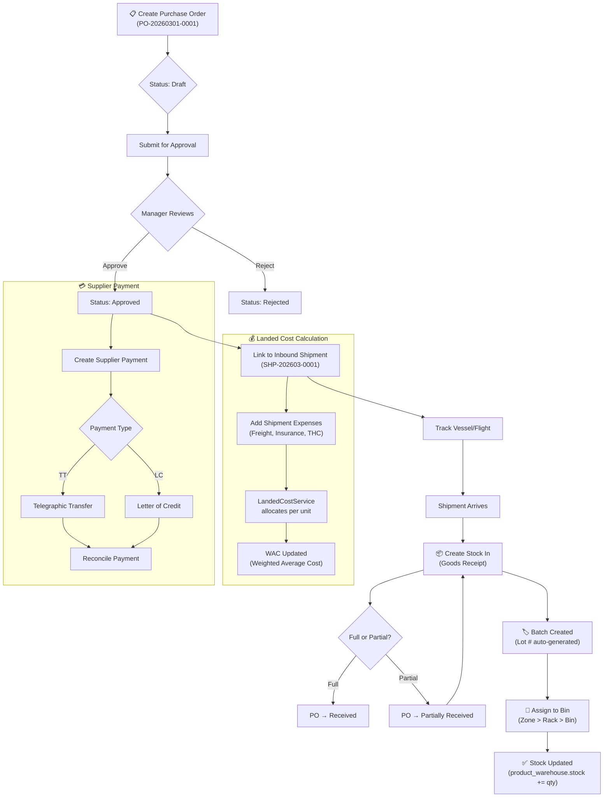
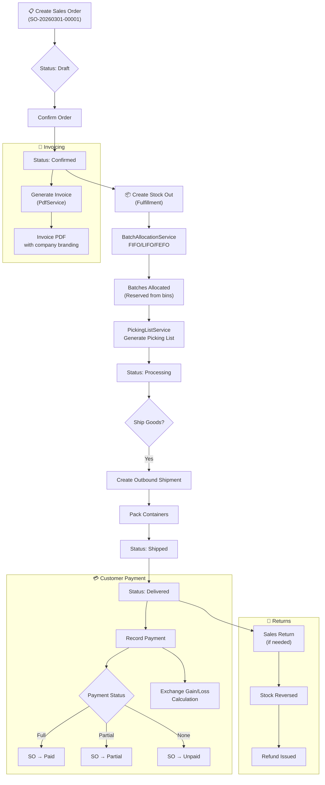
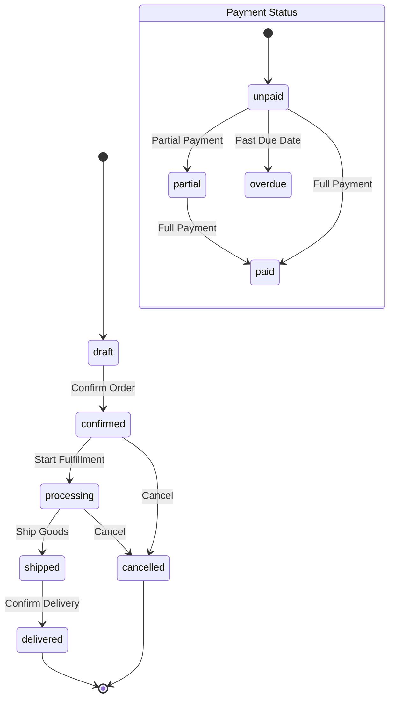
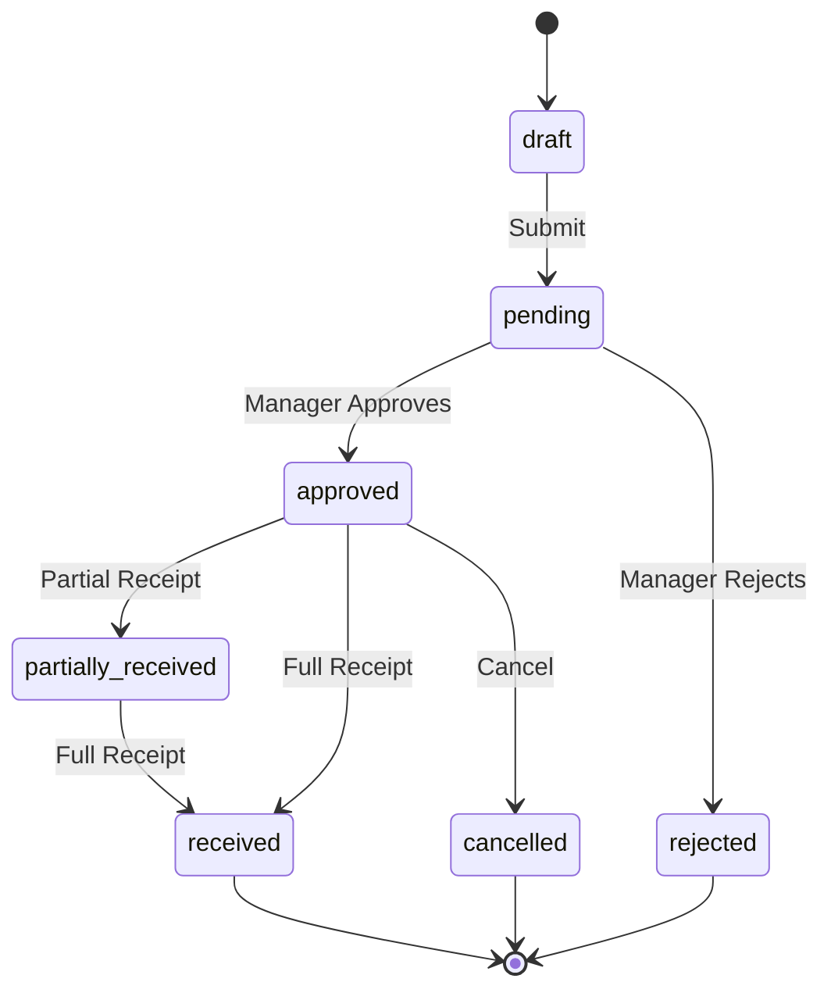
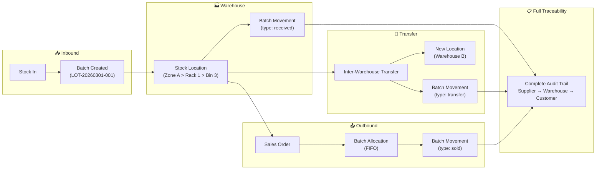
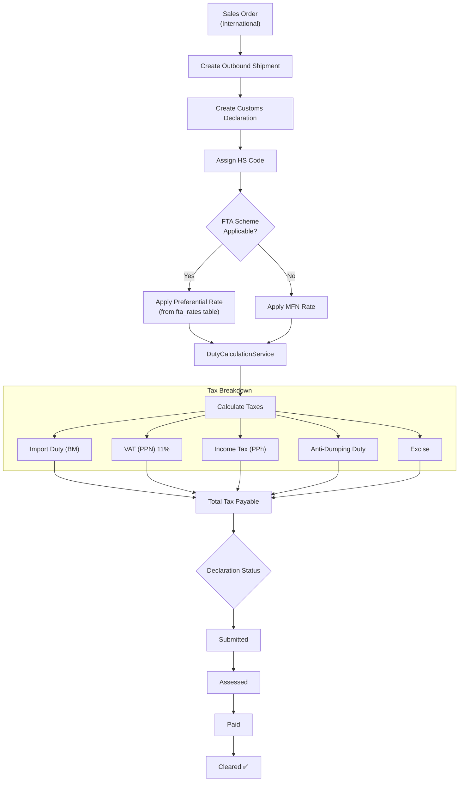
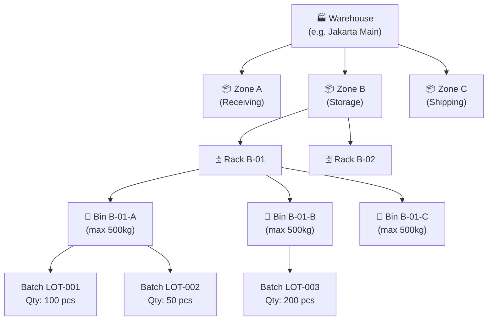
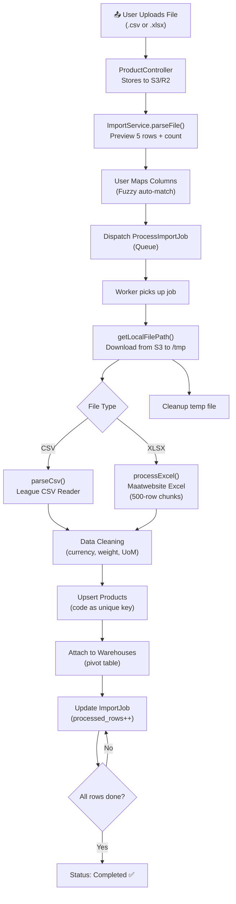
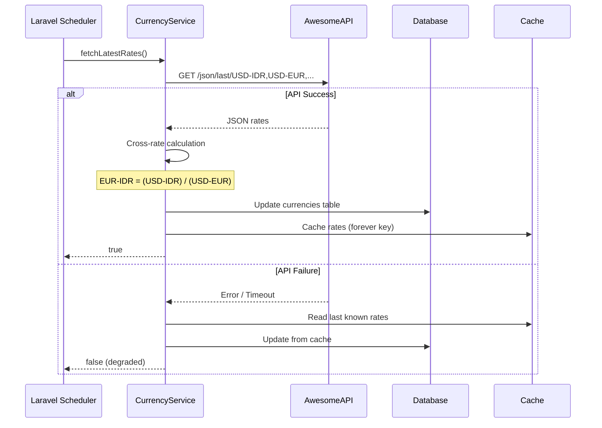
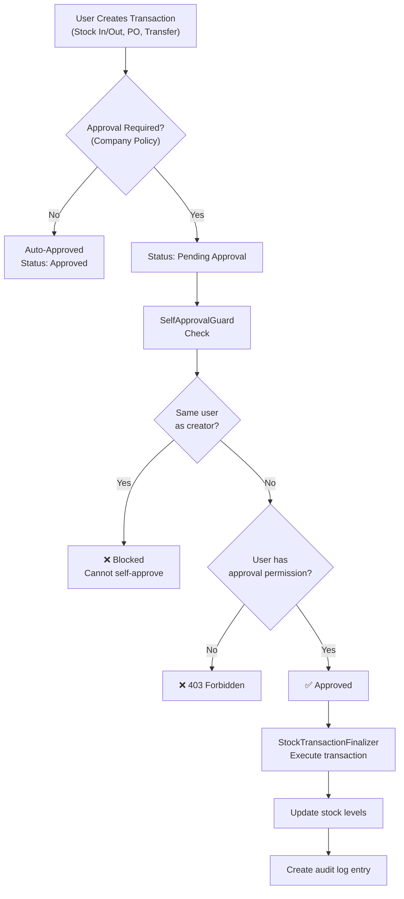

# 🔄 Business Flow Diagrams

> End-to-end workflows for the core business processes in **GetLanded**.

---

## 1. Procurement Flow (Inbound)

---

## 2. Sales Flow (Outbound)

---

## 3. Sales Order State Machine

---

## 4. Purchase Order State Machine

---

## 5. Batch Traceability Flow

---

## 6. Customs & Export Compliance Flow

---

## 7. Warehouse Location Hierarchy

---

## 8. Import (CSV/Excel) Processing Flow

---

## 9. Currency Exchange Rate Sync

---

## 10. Approval Workflow

