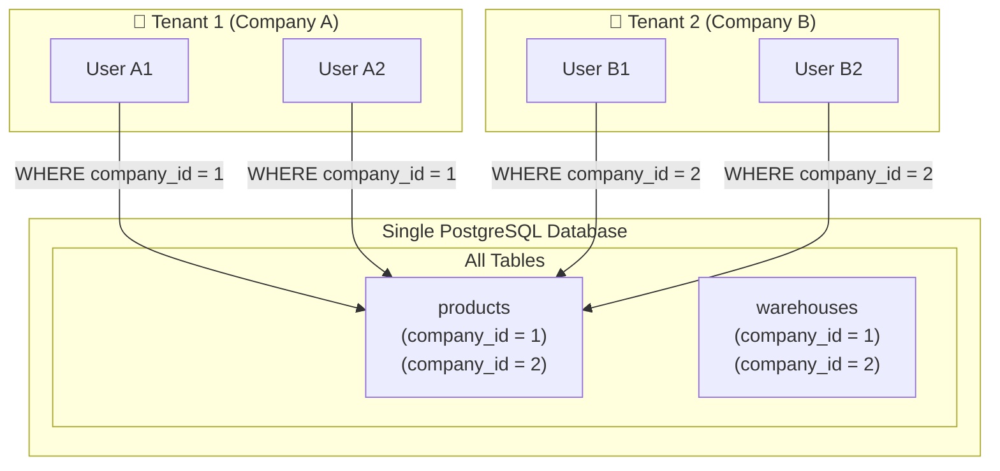
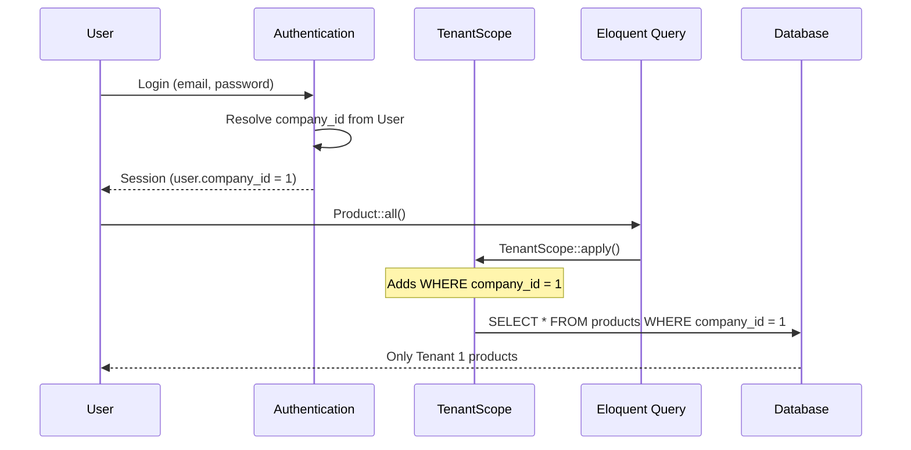
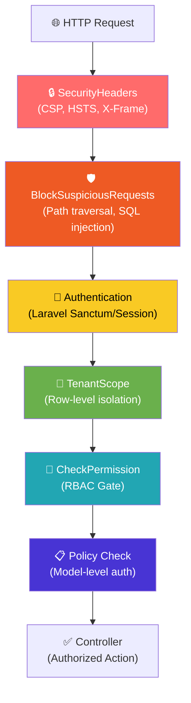
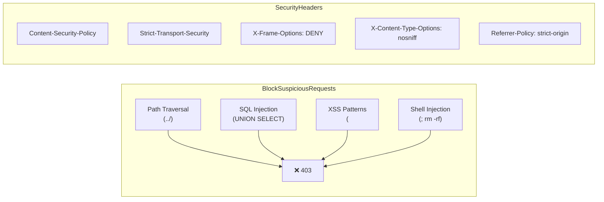
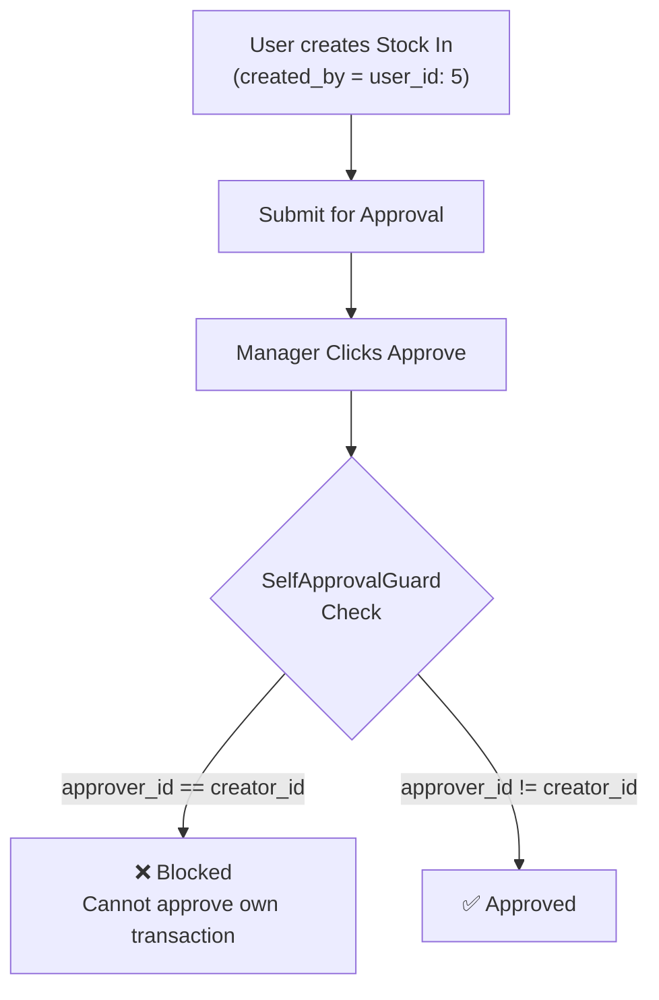
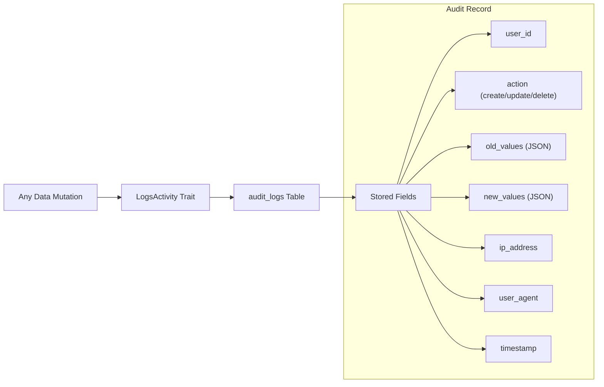
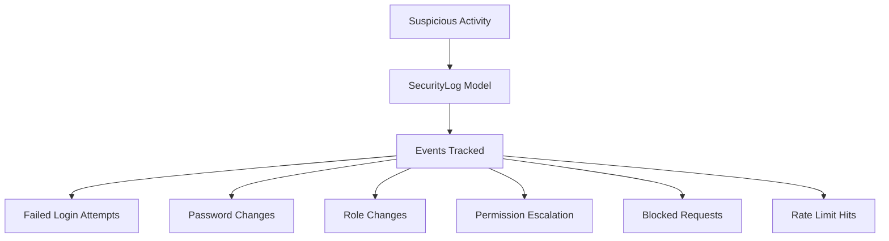

# 🔐 Security & Multi-Tenancy Architecture

> Security model and data isolation strategy for **GetLanded** SaaS.

---

## Multi-Tenancy Model

GetLanded uses **Single Database, Row-Level Isolation** — the most scalable SaaS pattern.



### How It Works



### Key Components

| Component | File | Purpose |
|-----------|------|---------|
| `TenantScope` | `app/Models/Scopes/TenantScope.php` | Global scope — auto-adds `WHERE company_id = ?` |
| `BelongsToTenant` | `app/Models/Traits/BelongsToTenant.php` | Trait — applies scope + auto-sets `company_id` on create |

### Tenant-Scoped Models (27+)

| Domain | Models |
|--------|--------|
| **Catalog** | Product, Category, ProductVariant |
| **Warehouse** | Warehouse, WarehouseZone, WarehouseRack, WarehouseBin |
| **Stock** | StockIn, StockOut, StockOpname, Batch, StockLocation |
| **Procurement** | Supplier, PurchaseOrder, SupplierPayment |
| **Sales** | Customer, SalesOrder, Invoice, Payment |
| **Shipping** | InboundShipment, OutboundShipment, ShipmentExpense |
| **Customs** | CustomsDeclaration, CustomsPermit, FtaScheme |
| **System** | Document, AuditLog, ImportJob, Webhook |

---

## Authorization Architecture



### Two-Layer Authorization

```
Layer 1: TenantScope (Data Filtering)
├── Automatic — applied to ALL queries
├── Prevents cross-tenant data access
└── Cannot be bypassed by regular users

Layer 2: RBAC + Policies (Action Authorization)
├── Role-based — assigns permissions to roles
├── Policy-based — model-level create/update/delete
└── Gate-based — custom permission checks
```

### Permission Matrix

| Permission | Admin | Manager | Staff | Viewer |
|-----------|:-----:|:-------:|:-----:|:------:|
| `stock.in.create` | ✅ | ✅ | ✅ | ❌ |
| `stock.out.create` | ✅ | ✅ | ✅ | ❌ |
| `stock.adjustment` | ✅ | ✅ | ❌ | ❌ |
| `transaction.approve` | ✅ | ✅ | ❌ | ❌ |
| `transaction.reject` | ✅ | ✅ | ❌ | ❌ |
| `finance.view` | ✅ | ✅ | ❌ | ❌ |
| `currency.manage` | ✅ | ❌ | ❌ | ❌ |
| `user.manage` | ✅ | ❌ | ❌ | ❌ |
| `role.manage` | ✅ | ❌ | ❌ | ❌ |
| `report.view` | ✅ | ✅ | ✅ | ✅ |
| `report.export` | ✅ | ✅ | ❌ | ❌ |
| `sales.view` | ✅ | ✅ | ✅ | ❌ |
| `invoice.view` | ✅ | ✅ | ❌ | ❌ |

---

## Security Controls

### Request Security



### Self-Approval Prevention



### Audit Trail



### Security Log



---

## Data Protection (UU PDP Compliance)

| Requirement | Implementation |
|------------|---------------|
| **Data Sovereignty** | Configurable database region |
| **Logical Separation** | TenantScope (row-level) |
| **Encryption at Rest** | Database-level encryption |
| **Audit Logs** | All mutations recorded with IP + user agent |
| **Access Control** | RBAC with granular permissions |
| **Data Minimization** | Soft deletes preserve data integrity |
| **Consent** | User registration requires explicit consent |
