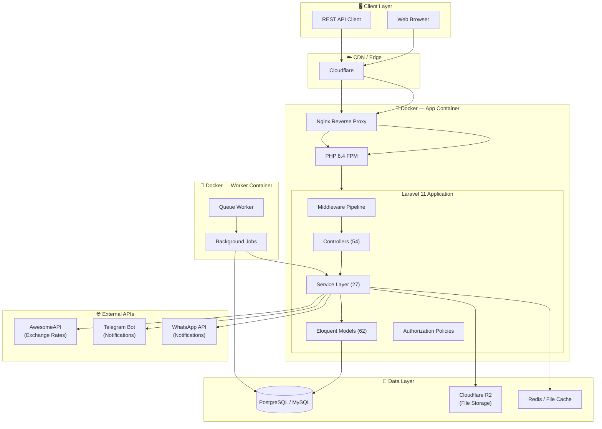
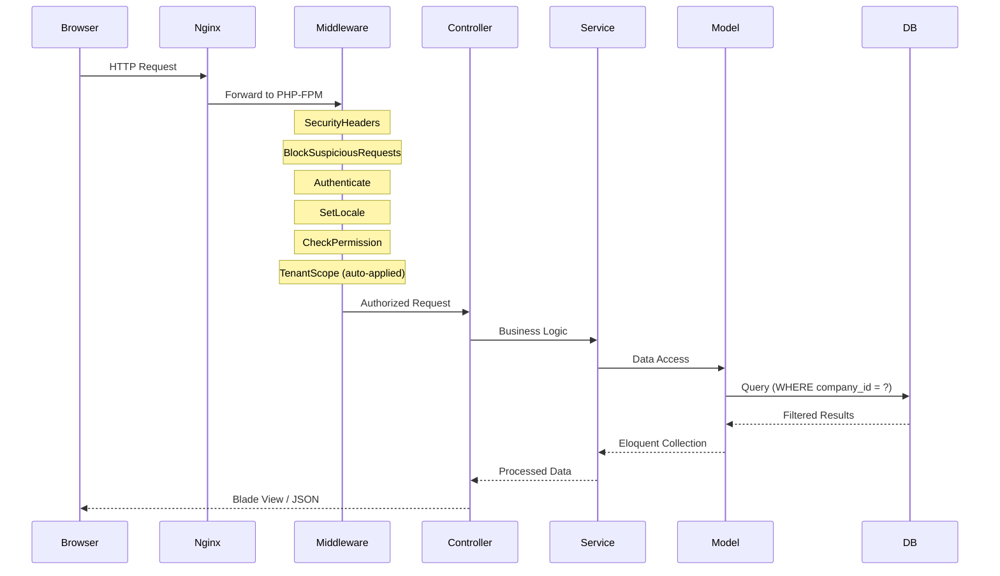
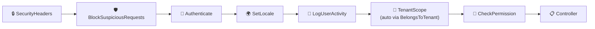
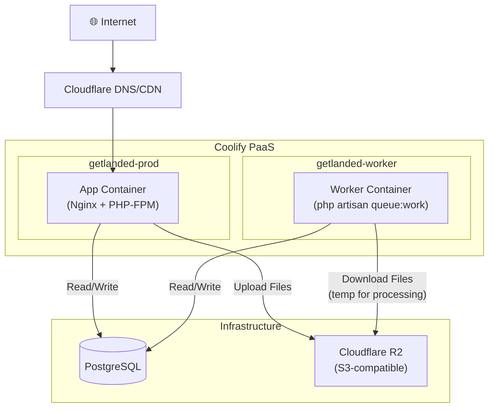

# 🏗️ System Architecture Overview

> **GetLanded** is a multi-tenant SaaS platform for import/export warehouse management,
> built with **Laravel 11**, **Blade/Vite**, and deployed via **Docker + Coolify**.

---

## High-Level Architecture

---

## Request Lifecycle

---

## Service Layer Map

| Service | Responsibility |
|---------|---------------|
| `ImportService` | Smart CSV/Excel import with fuzzy matching, chunking, S3 support |
| `BatchService` | FIFO/LIFO/FEFO batch allocation and tracking |
| `BatchAllocationService` | Allocate batches to outbound orders |
| `BatchInboundService` | Create batches from stock-in transactions |
| `LandedCostService` | Calculate landed cost per unit across shipment expenses |
| `DutyCalculationService` | Indonesian customs duty calculation (BM, PPN, PPh, Anti-Dumping) |
| `CurrencyService` | Real-time exchange rate sync via AwesomeAPI |
| `StockTransactionFinalizer` | Finalize stock-in/out with approval workflow |
| `SoftInventoryService` | Soft reservation of stock for pending orders |
| `PickingListService` | Generate warehouse picking lists for fulfillment |
| `PdfService` | Invoice, packing list, and document PDF generation |
| `DocumentService` | File attachment management for shipments |
| `UomConversionService` | Unit of Measure conversion (kg↔lbs, pcs↔dozen, etc.) |
| `InventoryReportService` | Dashboard aggregation and analytics |
| `TrackingService` | Shipment tracking number management |
| `AlertService` | Low stock, expiry, and overdue alerts |
| `GlobalSearchService` | Cross-entity search (products, orders, customers) |
| `GeocodingService` | Supplier address geocoding |
| `WebhookService` | Outbound webhook event dispatch |
| `TelegramService` | Telegram notification delivery |
| `WhatsappService` | WhatsApp notification delivery |
| `SelfApprovalGuard` | Prevent users from approving their own transactions |
| `HolidayService` | Business day calculation for delivery estimates |
| `BackupService` | Database backup management |
| `NotificationThrottleService` | Rate-limit notifications per user |

---

## Middleware Pipeline

---

## Deployment Architecture (Coolify)

